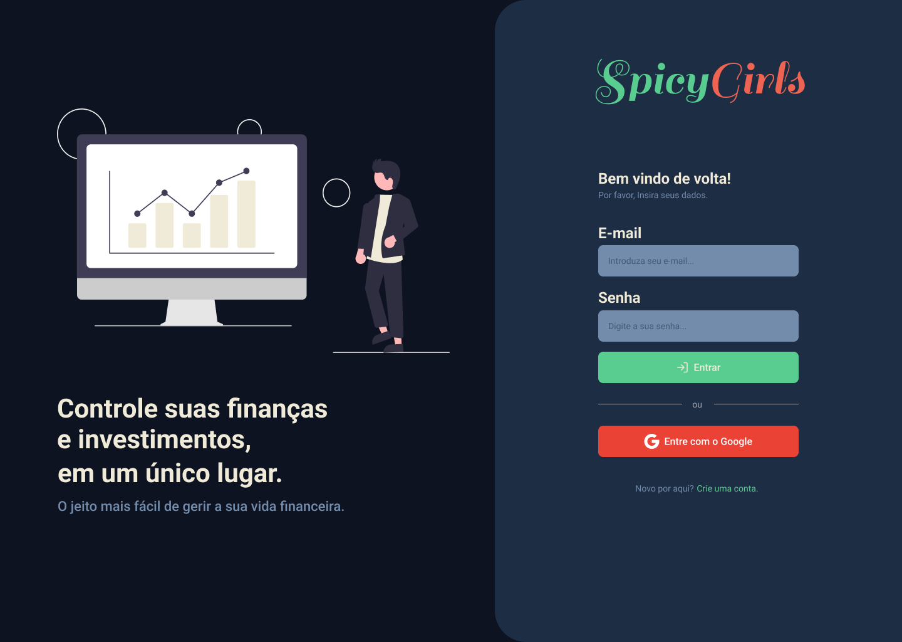

# DinDin

Engenharia de Software

## Participantes

* Leandro Sena de Andrade Machado
* Guilherme Drumond Silva
* Bryan Rosemberg de Abreu
* Gabriel Afonso Infante Vieira
* Arthur do Nascimento Sita Gomes

# Estrutura do Documento

- [Informações do Projeto](#informações-do-projeto)
  - [Participantes](#participantes)
- [Estrutura do Documento](#estrutura-do-documento)
- [Introdução](#introdução)
  - [Problema](#problema)
  - [Objetivos](#objetivos)
  - [Justificativa](#justificativa)
  - [Público-Alvo](#público-alvo)
- [Especificações do Projeto](#especificações-do-projeto)
  - [Personas e Mapas de Empatia](#personas-e-mapas-de-empatia)
  - [Histórias de Usuários](#histórias-de-usuários)
  - [Requisitos](#requisitos)
    - [Requisitos Funcionais](#requisitos-funcionais)
    - [Requisitos não Funcionais](#requisitos-não-funcionais)
  - [Restrições](#restrições)
- [Projeto de Interface](#projeto-de-interface)
  - [User Flow](#user-flow)
  - [Wireframes](#wireframes)
- [Metodologia](#metodologia)
  - [Divisão de Papéis](#divisão-de-papéis)
  - [Ferramentas](#ferramentas)
  - [Controle de Versão](#controle-de-versão)
- [**############## SPRINT 1 ACABA AQUI #############**](#-sprint-1-acaba-aqui-)
- [Projeto da Solução](#projeto-da-solução)
  - [Tecnologias Utilizadas](#tecnologias-utilizadas)
  - [Arquitetura da solução](#arquitetura-da-solução)
- [Avaliação da Aplicação](#avaliação-da-aplicação)
  - [Plano de Testes](#plano-de-testes)
  - [Ferramentas de Testes (Opcional)](#ferramentas-de-testes-opcional)
  - [Registros de Testes](#registros-de-testes)
- [Referências](#referências)

# Introdução
Esta documentação tem como objetivo principal apresentar uma plataforma web “Dindin”. 
No brasil, várias pessoas sofrem com endividamento, altos impostos e falta de dinheiro. Grande 
parte das vezes, esses problemas estão relacionados com a falta de gestão financeira, que é um 
fator fundamental que todas as pessoas deveriam ter conhecimento. Este trabalho, propõe 
implementar um sistema que auxilie a gestão financeira de pessoas, por meio de uma plataforma 
web.
## Problema

De acordo com a pesquisa do SPC Brasil revela que 47, dos jovens, entre 18 e 25 anos, não 
faz controle de seus gastos. O que é um reflexo do aumento do endividamento brasileiro que 
atingiu em março o recorde máximo histórico, com 77,5%. Segundo a Pesquisa de 
Endividamento e Inadimplência do Consumidor, da Confederação Nacional do Comércio de 
Bens, Serviços e Turismo, o percentual é 10,3 pontos acima do registrado há um ano, quando 
essa parcela era de 67,3%. Isso revela, que há uma grande carência em relação ao gerenciamento 
financeiro, que é um fator intensificador da problemática do endividamento.

## Objetivos

"Dindin" é uma plataforma web que tem como objetivo amparar as pessoas sobre como 
gerenciar o próprio dinheiro para conquistar seus objetivos e metas estabelecidas, para isso o 
sistema apresenta formas e alternativas que garantem um bom controle financeiro, deste modo, 
possibilitando aos usuários caminhos para garantir uma estabilidade e independência financeira 
evitando diversos problemas futuros.

## Justificativa

Com a problemática apresentada, é possível analisar que vários indivíduos possuem 
diversos problemas financeiros, os quais muitas vezes recorrem a empréstimos bancários, 
ocasionando assim, em endividamento. Já existem aplicativos que auxiliam as pessoas a 
gerenciar o dinheiro, porém muitas vezes possuem uma linguagem complexa e inacessível para 
pessoas que pretendem iniciar sua gestão financeira. Com isso, a desistência relacionada ao 
aprendizado nesta área é alta, por se tratar de um tema delicado. Levando isso em consideração, 
desenvolvemos a ideia de criar uma plataforma web feita exclusivamente para pessoas 
desinformadas nesta área, com linguagem acessível e interface simples.

## Público-Alvo

Após as coletas de dados das entrevistas feitas, foi possível identificar dois tipos de perfis. 
Cada um destes perfis está relacionado com o perfil da pessoa, um mais ativo e o outro mais 
passivo e são jovens e adultos de classe média e alta.
1.5.1: Usuário investidor: Este tipo de perfil é uma pessoa que já possui um certo 
conhecimento no mercado e busca ampliar seus investimentos, por meio de um gerenciamento 
financeiro correto. Costumam se arriscar mais ao investir e buscam progredir financeiramente.
1.5.2: Usuário endividado: Este tipo de perfil é uma pessoa que possui dificuldades 
financeiras, e busca se reerguer financeiramente. Normalmente são pessoas mais conservadoras 
que não gostam de assumir muitos riscos.

# Especificações do Projeto

Informações importantes sobre os processos e ferramentas utilizadas no projeto.

Técnicas utilizadas:
- Design Thinking
- Framework

Ferramentas Utilizadas:
- Miro
- Figma
- Docs
- Drive

## Personas e Mapas de Empatia

> 
> 

## Histórias de Usuários

Com base na análise das personas forma identificadas as seguintes histórias de usuários:

|EU COMO... `PERSONA`| QUERO/PRECISO ... `FUNCIONALIDADE` |PARA ... `MOTIVO/VALOR`                 |
|--------------------|------------------------------------|----------------------------------------|
|Usuário do sistema  | Conhecimento de investimento       | Estabilidade financeira                |
|Administrador       | Conhecimento de renda.             | Acúmulo de capital.                    |
                     | Dicas de como gerir o dinheiro.    |
                     | Facilitação da administração de    |
                       seu dinheiro.

## Requisitos

As tabelas que se seguem apresentam os requisitos funcionais e não funcionais que detalham o escopo do projeto.

### Requisitos Funcionais

|ID    | Descrição do Requisito  | Prioridade |
|------|-----------------------------------------|----|
|RF-001| Aba de controle de gastos. | ALTA | 
|RF-002| Acompanhamento de resultados (gráficos/tabelas).   | ALTA |
|RF-003| Acompanhamento de mercado em tempo real.   | ALTA |
|RF-004| Aba de preço baseado no seu tempo de trabalho   | ALTA |

### Requisitos não Funcionais

|ID     | Descrição do Requisito  |Prioridade |
|-------|-------------------------|----|
|RNF-001| O sistema deve ser responsivo para rodar em um dispositivos móvel | MÉDIA | 
|RNF-002| Segurança. |  ALTA | 
|RNF-004| Criação de usuário (com base no perfil). | MÉDIA | 
|RNF-005| Baixa Latência. | MÉDIA | 
|RNF-006| Multiplataforma. | BAIXA | 

> - [Requisitos Funcionais (RF)]
> 
● Aba de controle de gastos.
● Acompanhamento de resultados (gráficos/tabelas).
● Acompanhamento de mercado em tempo real.
● Aba de preço baseado no seu tempo de trabalho
>
> - [Requisitos Não Funcionais (RNF)]
> 
● Segurança.
● Criação de usuário (com base no perfil).
● Latência.
● Multiplataforma

## Restrições

O projeto está restrito pelos itens apresentados na tabela a seguir.

|ID| Restrição                                             |
|--|-------------------------------------------------------|
|01| O projeto deverá ser entregue até o final do semestre |
|02| Não pode ser desenvolvido um módulo de backend        |
|03| O projeto tem uma expectativa de 20 semanas (de início)  |
|04| Devido a falta de renda o custo do projeto deve beirar o nulo  |
|05| O projeto nessas primeiras 20 semanas deve atingir uma alta qualidade, porém com
poucas funcionalidades (versão beta)        |

Tempo:
O projeto tem uma expectativa de 20 semanas (de início).

Custo:
Devido a falta de renda o custo do projeto deve beirar o nulo.

Qualidade:
O projeto nessas primeiras 20 semanas deve atingir uma alta qualidade, porém com
poucas funcionalidades (versão beta).

# Projeto de Interface

## User Flow

> 

## Wireframes

> 
> 
> 
> 
> 

# Metodologia

Processos
Na primeira parte do projeto iniciamos a etapa de concepção, na qual iniciamos o 
processo de desing thinking. Primeiramente, pesquisamos a respeito das possíveis dores do 
cliente, para poder definir os tipos de perfis. Foram feitas entrevistas com vários usuários para 
auxiliar nessa escolha. Após essa etapa, traçamos os tipos de perfis e iniciamos o processo de 
brainstorm de ideias, onde foram selecionadas, priorizadas e detalhadas.
Na segunda parte do projeto, iniciamos a prototipação do site, para que depois
iniciarmos a parte de desenvolvimento, na qual iriamos implantar efetivamente a solução do 
problema. Durante todo o processo, utilizamos a metodologia Scrum, com reuniões diárias entre 
10 a 15 minutos e reuniões ocasionais de 1 a 2 horas, para discutirmos sobre o projeto.

Etapa do entendimento

Matriz CSD e Mapa dos Stakeholders

Foi realizada uma reunião entre toda a equipe para insights sobre o problema, e as
principais pessoas fundamentais, importantes, e influenciadores do nosso negócio e projeto.
Entrevista Qualitativa e Highlights de Pesquisa
Foi realizada uma reunião entre toda a equipe para a determinação das principais perguntas
de valor qualitativo para a pesquisa de mercado, após determinação das perguntas,
realizamos um formulário online através do forms e enviamos para amigos, familiares e
colegas da faculdade.
Após a mensuração dos resultados obtidos através do questionário elaborado, foi realizada
uma reunião entre toda a equipe onde determinamos os principais dados qualitativos sobre
o mercado.

Personas e Mapas de Empatia

Os membros Arthur e Guilherme foram encarregados de construir as personas baseadas
nos tipos de perfis que responderam o nosso questionário, que ao todo gerou 2 personas.
Etapa de desenvolvimento
Brainwriting, Mural de Possibilidades, Priorização de Idéias e Detalhamento das Idéias
Foi realizada uma reunião entre todos os membros da equipe para determinar desde o
brainwriting até o detalhamento das idéias. Nós usamos a seguinte metodologia :

● Foram criadas colunas de post-its para cada membro do grupo no ambiente miro.
● Cada membro inseriu as suas ideias de soluções em sua coluna determinada.
● Cada membro do grupo avaliou cada ideia escrita em post-it.
● Foi calculado a média das notas dadas pelos membros do grupo.
● Cada nota ganhou a sua pontuação através da média das notas calculadas.

As ideias mais bem avaliadas pelos membros do grupo foram priorizadas, e inseridas no
nosso mural de possibilidades.
Foi realizada uma reunião entre todos os membros do grupo para a priorização de ideias na
função custo x impacto.
Foi realizada uma reunião entre todos os membros do grupo e durante a reunião guilherme,
bryan, e gabriel fizeram o detalhamento das idéias através do mapa conceitual.
Etapa de apresentação
Foi realizada uma reunião entre todos os membros do grupo e durante a reunião o Gabriel
ficou encarregado de produzir o slide, enquanto os outros membros auxiliavam com as
idéias e organização, durante o desenvolvimento do slide cada um escolheu a sua parte de
apresentação.

Etapa da documentação do projeto

Foi realizada uma reunião entre todos os membros do grupo e foi realizada uma divisão de
tarefas, em que :
● Gabriel e Bryan ficaram responsáveis pelas especificações do projeto.
● Artur ficou responsável pelo projeto de interface.
● Guilherme ficou responsável pela descrição do projeto.
● Leandro ficou responsável pela metodologia e referências do projeto.

> Nesta parte do documento, você deve apresentar a metodologia 
> adotada pelo grupo, descrevendo o processo de trabalho baseado nas metodologias ágeis, 
> a divisão de papéis e tarefas, as ferramentas empregadas e como foi realizada a
> gestão de configuração do projeto via GitHub.
>
> Coloque detalhes sobre o processo de Design Thinking e a implementação do Framework Scrum seguido
> pelo grupo. O grupo poderá fazer uso de ferramentas on-line para acompanhar
> o andamento do projeto, a execução das tarefas e o status de desenvolvimento
> da solução.

## Divisão de Papéis

Foi realizada uma reunião entre todos os membros do grupo e foi realizada uma divisão de
tarefas, em que :
● Gabriel e Bryan ficaram responsáveis pelas especificações do projeto.
● Artur ficou responsável pelo projeto de interface.
● Guilherme ficou responsável pela descrição do projeto.
● Leandro ficou responsável pela metodologia e referências do projeto.

## Ferramentas

......  COLOQUE AQUI O SEU TEXTO - SIGA O EXEMPLO DA TABELA ABAIXO  ......

| Ambiente  | Plataforma              |Link de Acesso |
|-----------|-------------------------|---------------|
|Processo de Design Thinkgin  | Miro | [ https://miro.com/XXXXXXX ](https://miro.com/app/board/uXjVOBTTW0U=)| 
|Repositório de código | GitHub | [https://github.com/XXXXXXX](https://github.com/ICEI-PUC-Minas-PPLES-TI/plf-es-2022-1-ti1-7924100-dindin) | 
|Hospedagem do site | Netlify |  [https://XXXXXXX.herokuapp.com](http://Odindin.netlify.app) | 
|Protótipo Interativo | MavelApp ou Figma | [https://figma.com/XXXXXXX](https://figma.com/file/mYfbKXroiISV9oHnw9Xhyb/Spicy-Girls?node-id=3:10) | 

>
> Liste as ferramentas empregadas no desenvolvimento do
> projeto, justificando a escolha delas, sempre que possível.
> 
> As ferramentas empregadas no projeto são:
> 
> - Editor de código: Visual Studio Code.
> - Ferramentas de comunicação: Discord e WhatsApp.
> - Ferramentas de diagramação: Figma e Miro.
> - Plataforma de hospedagem: Netlify;

> O editor de código foi escolhido porque ele possui uma integração com o sistema de versão. As ferramentas de comunicação utilizadas possuem integração semelhante e por isso foram selecionadas. Por fim, para criar diagramas utilizamos essa ferramenta por melhor captar as necessidades da nossa solução.

## Controle de Versão

......  COLOQUE AQUI O SEU TEXTO ......

> Discuta como a configuração do projeto foi feita na ferramenta de
> versionamento escolhida. Exponha como a gerência de tags, merges,
> commits e branchs é realizada. Discuta como a gerência de issues foi
> realizada.
> A ferramenta de controle de versão adotada no projeto foi o
> [Git](https://git-scm.com/), sendo que o [Github](https://github.com)
> foi utilizado para hospedagem do repositório `upstream`.
> 
> O projeto segue a seguinte convenção para o nome de branchs:
> 
> - `master`: versão estável já testada do software
> - `unstable`: versão já testada do software, porém instável
> - `testing`: versão em testes do software
> - `dev`: versão de desenvolvimento do software
> 
> Quanto à gerência de issues, o projeto adota a seguinte convenção para
> etiquetas:
> 
> - `bugfix`: uma funcionalidade encontra-se com problemas
> - `enhancement`: uma funcionalidade precisa ser melhorada
> - `feature`: uma nova funcionalidade precisa ser introduzida
>
> **Links Úteis**:
> - [Tutorial GitHub](https://guides.github.com/activities/hello-world/)
> - [Git e Github](https://www.youtube.com/playlist?list=PLHz_AreHm4dm7ZULPAmadvNhH6vk9oNZA)
> - [5 Git Workflows & Branching Strategy to deliver better code](https://zepel.io/blog/5-git-workflows-to-improve-development/)
>
> **Exemplo - GitHub Feature Branch Workflow**:
>
> 

# **############## SPRINT 1 ACABA AQUI #############**

# Projeto da Solução

......  COLOQUE AQUI O SEU TEXTO ......

## Tecnologias Utilizadas

Neste projeto utilizamos as tecnologias HTML, CSS e JavaScript para resolver a problemática.
Framework: nenhum.
IDE de desenvolvimento: VSCode.
Ferramentas: WhatsApp, Discord, Figma, Miro, GitHub, Netlify.

> Descreva aqui qual(is) tecnologias você vai usar para resolver o seu
> problema, ou seja, implementar a sua solução. Liste todas as
> tecnologias envolvidas, linguagens a serem utilizadas, serviços web,
> frameworks, bibliotecas, IDEs de desenvolvimento, e ferramentas.
> Apresente também uma figura explicando como as tecnologias estão
> relacionadas ou como uma interação do usuário com o sistema vai ser
> conduzida, por onde ela passa até retornar uma resposta ao usuário.

> Inclua os diagramas de User Flow, esboços criados pelo grupo
> (stoyboards), além dos protótipos de telas (wireframes). Descreva cada
> item textualmente comentando e complementando o que está apresentado
> nas imagens.

## Arquitetura da solução

......  COLOQUE AQUI O SEU TEXTO E O DIAGRAMA DE ARQUITETURA .......

> Inclua um diagrama da solução e descreva os módulos e as tecnologias
> que fazem parte da solução. Discorra sobre o diagrama.
> 
> **Exemplo do diagrama de Arquitetura**:
> 
> 

# Avaliação da Aplicação

......  COLOQUE AQUI O SEU TEXTO ......

> Apresente os cenários de testes utilizados na realização dos testes da
> sua aplicação. Escolha cenários de testes que demonstrem os requisitos
> sendo satisfeitos.

## Plano de Testes

......  COLOQUE AQUI O SEU TEXTO ......

> Enumere quais cenários de testes foram selecionados para teste. Neste
> tópico o grupo deve detalhar quais funcionalidades avaliadas, o grupo
> de usuários que foi escolhido para participar do teste e as
> ferramentas utilizadas.
> 
> **Links Úteis**:
> - [IBM - Criação e Geração de Planos de Teste](https://www.ibm.com/developerworks/br/local/rational/criacao_geracao_planos_testes_software/index.html)
> - [Práticas e Técnicas de Testes Ágeis](http://assiste.serpro.gov.br/serproagil/Apresenta/slides.pdf)
> -  [Teste de Software: Conceitos e tipos de testes](https://blog.onedaytesting.com.br/teste-de-software/)

## Ferramentas de Testes (Opcional)

......  COLOQUE AQUI O SEU TEXTO ......

> Comente sobre as ferramentas de testes utilizadas.
> 
> **Links Úteis**:
> - [Ferramentas de Test para Java Script](https://geekflare.com/javascript-unit-testing/)
> - [UX Tools](https://uxdesign.cc/ux-user-research-and-user-testing-tools-2d339d379dc7)

## Registros de Testes

......  COLOQUE AQUI O SEU TEXTO ......

> Discorra sobre os resultados do teste. Ressaltando pontos fortes e
> fracos identificados na solução. Comente como o grupo pretende atacar
> esses pontos nas próximas iterações. Apresente as falhas detectadas e
> as melhorias geradas a partir dos resultados obtidos nos testes.

# Referências

- https://slideplayer.com.br/slide/391625/
- Materias disponibilizados no Canvas. Processos de Design Thinking
